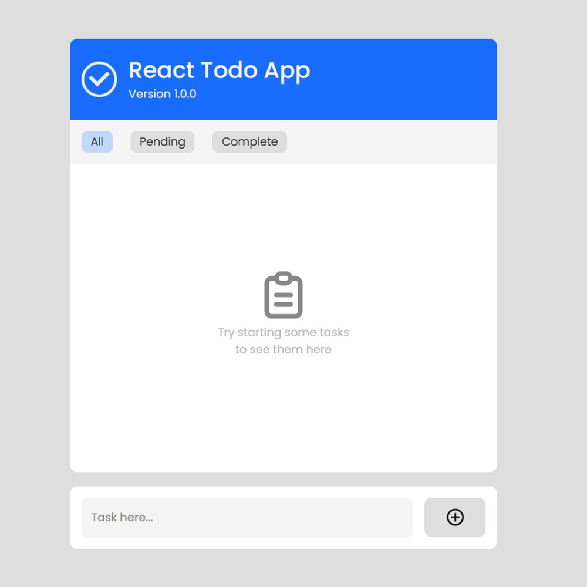
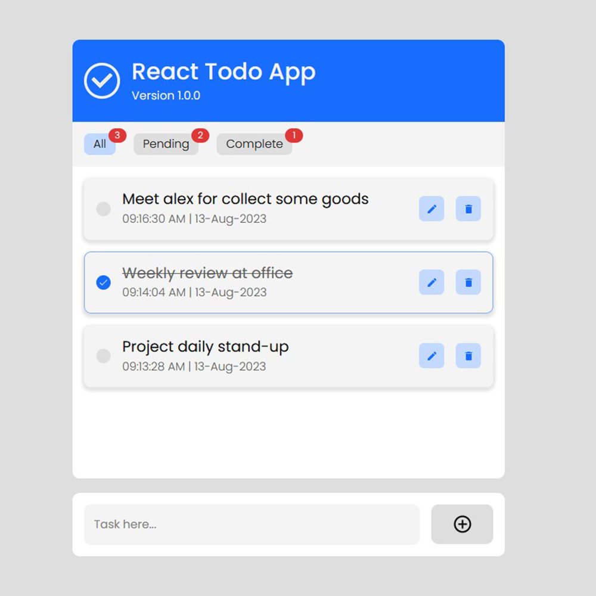

# React Todo App

The React Todo App is a feature-rich task management application built using a combination of cutting-edge technologies. It employs the Redux Toolkit and Context API for state management, ensuring efficient handling of application data and allowing seamless communication between components. This results in a smooth and responsive user experience.

For providing user feedback and notifications, the app integrates React Hot Toast. This library offers customizable and aesthetically pleasing notifications that can be triggered in response to various user actions, such as adding or completing tasks.

## Requirements

- Basic HTML, CSS & Javascript knowledge.
- Basic React JS knowledge.
- Basic Redux Toolkit knowledge.

## How to Install & Run

To run the application, follow these steps:

1. Clone the repository or download it as a ZIP file.
2. In a terminal, navigate to the folder where the application is located.
3. Run the **npm install** command to install all the necessary dependencies.

```shell
npm install
```

4. Run the **npm run dev** command to start the application in development mode.

```shell
npm run dev
```

5. Open your browser and navigate to **http://localhost:5173** to use the application.

```shell
http://localhost:5173
```

## Application Features

The app allows users to create, update, delete, and mark tasks as complete or incomplete. The React Todo App is a dynamic and interactive web application designed to help users efficiently manage their tasks and to-do lists. The app incorporates a range of cutting-edge technologies to deliver a seamless and engaging user experience.

- Task Management.
- Task Creation.
- Task Modification.
- Task Deletion.
- Task Completion.
- User-Friendly Alerts.
- Interactive Animations.
- Efficient State Management.

## Technologies Used

React Todo App is a powerful task management solution that combines the best of various technologies like Redux Toolkit, Context API, React, Framer Motion, and React Hot Toast. It offers users an intuitive interface with smooth animations and real-time notifications, making task organization and tracking a seamless experience.

- React JS
- React Redux
- Redux Toolkit
- React Hooks
- React Hot Toast
- Framer Motion
- React Context API
- Localstorage

## Contribution

If you'd like to contribute to this project, feel free to submit a pull request. Before doing so, be sure to create a separate branch for your changes.

## Buy A Coffee

Like my works and want to support me?

<a href="https://www.buymeacoffee.com/hossainpalin" target="_blank"></a>

## Screenshots




## Live demo

Live previews are the best way for a better understanding of the application's user interface.

[Click here...](https://hossainpalin.github.io/React-Todo-App/)
